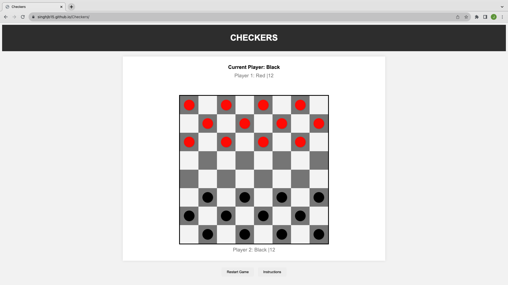
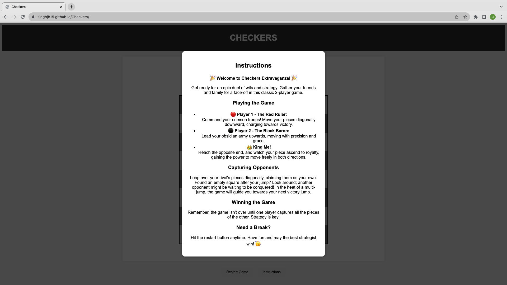

# Checkers

#### This is my first project "CHECKERS"! Based on the classic game!

## Description
Welcome to my debut in web-based game development. The goal was to create a vibrant rendition of the classic 2-player checkers game in a web-based application. 

## Table of Contents
* [Technologies Used](#technologiesused)
* [Features](#features)
* [How To Play](#Howtoplay)
* [Project Next Steps](#nextsteps)
* [Deployed App](#deployment)
* [About the Author](#author)

## Technologies Used
* JavaScript
* HTML5
* CSS3

## Features
* Players can seamlessly move pieces diagnolly across the board
* In-built ability to strategically jump over the opponent's pieces
* Intuitive guidance for players to make multi-jumps when available
* Game ends when one player's pieces are entirley captured
* Flexible Gameplay - player's can restart the game whenever they choose
* Integrated Instructions - players can access a comprehensive guide to the game at any moment
* Vibrant user interface enhancing the traditional checkerboard experience
* Player's progress is tracked with visual notifications
* Regular pieces get crowned when they reach the opposite end of the checkerboard

## How To Play

## Project Next Steps
* Implement AI feature if player wants to play against the computer
* Allow users to change the theme of the game

## Deployed Link
[Github](https://singhjb15.github.io/Checkers/)

* You can view the repository:
[Github.com](https://github.com/SinghJB15/Checkers)
* If unable to view please go live locally through VS Code
    

## About The Author
I'm a software engineer who loves to learn and grow. I enjoy building applications that align with my interests, but I'm also ready to take on challenging projects that test my skills. Every project I work on excites me and pushes me to do better in the ever-evolving tech world.
